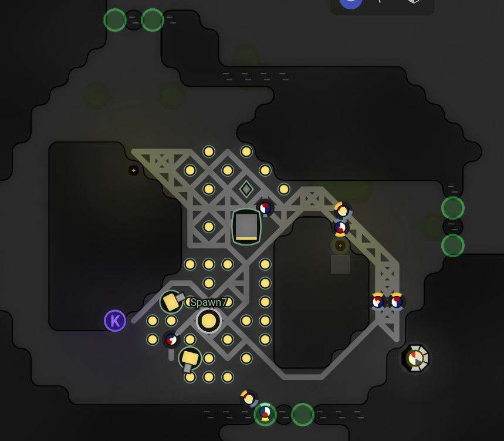

# Screeps
An AI for the screeps.com Game running on [my account](https://screeps.com/a/#!/profile/Harduim)

Screeps is an open-source game for programmers, wherein the core mechanic is programming
your units' AI. You control your colony by writing JavaScript.

## Implemented

### Roles
- Upgrader
- Harvester
- Energy resource distribuiter
- Remote harvester
- Remote storage hauler
- Energy migrator
- Link energy migrator
- Regular soldier
- Ranger soldier
- Healer
- Demolisher
- Tank

### Structures
- Spawn
- Towers
- Links

### Features
- Simple automatic base building
- Role switching accourding to base necessities
- Auto road building to the main room landmarks
- Remote Harvesting
- Basic room defense

## Not Implemented yet

### Roles
- Miner
- Remote Miner
- Wall/Rampart Repairer
- AOE Soldier
- Scout

### Structures
- Labs
- Factory
- Terminal

### Features
- Dynamic Base builder, including all structures
- Base rebuilder
- Better inter-room resource sharing
- Mining and boosting
- Market
- Soldier Squads
- Proximity room grouping
- Spawning queue, based on the room grouping
- Define creep role quantities based on room economy 

## To Do
- Find a better code formatter
- Figure out a way to integrate some profiler
- Benchmark energy efficiency of different logistics models
